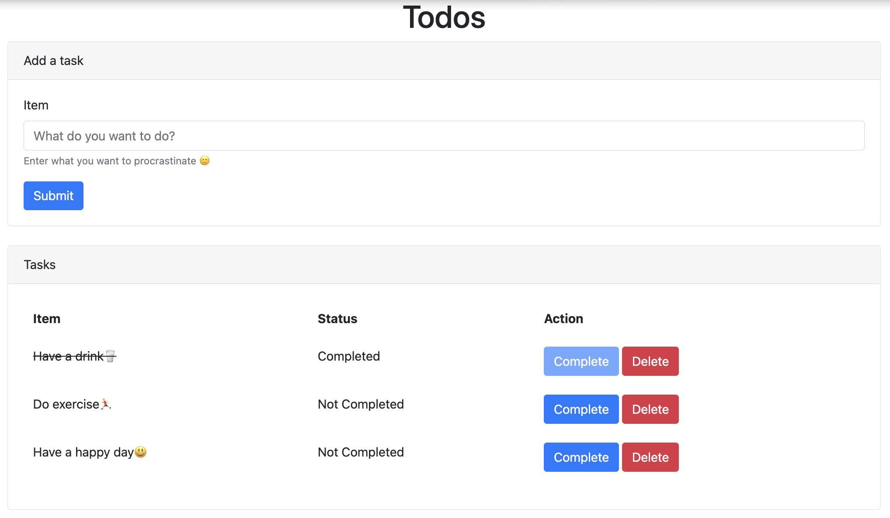

## Let's Go
`Let's Go` is a to-do list application written in `Go` with `Gin` and `Gorm` framework


## Prerequisite
- Gin
```
go get -u github.com/gin-gonic/gin
```
- Gorm (mysql)
```
go get -u gorm.io/gorm
go get -u gorm.io/driver/mysql
```
- godotenv
```
go get github.com/joho/godotenv
```

## Installation
- Clone this repo
```
git clone https://github.com/moseicshen/LetsGo.git
```
- Change into the dir
```
cd LetsGo
```
- Change environment settings in `.env`
```
PORT = 8080
DB_HOST = 127.0.0.1
DB_USER = root
DB_PASSWORD = 
```
- Run
```
go run main.go
```
- See at `localhost:8080`

## Thanks
Thanks to https://github.com/ichtrojan/go-todo/tree/master for HTML Templates
